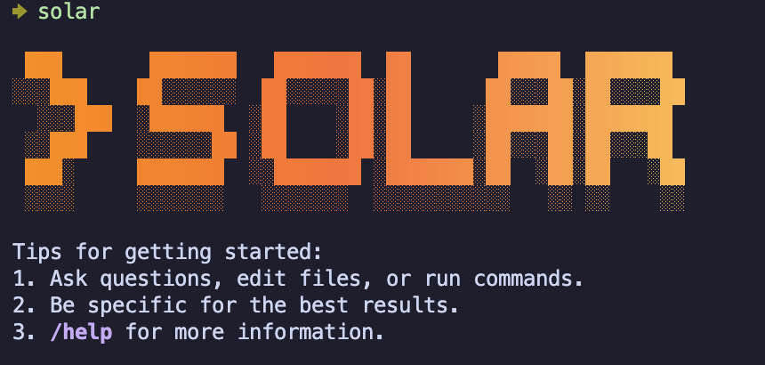

# Solar Code



This repository contains Solar Code, a command-line AI workflow tool powered by **Upstage Solar Pro2** that connects to your tools, understands your code and accelerates your workflows.

Solar Code is based on the excellent Gemini CLI architecture, enhanced to work with Upstage's Solar Pro2 model for Korean developers and organizations.

## 🚀 Quick Installation

Install Solar Code globally with a single command:

```bash
make install
```

Verify the installation:

```bash
solar --help
```

## 📋 Prerequisites

- **Node.js** 20 or higher
- **npm** (comes with Node.js)
- **Upstage API Key** ([Get yours here](https://console.upstage.ai/))

## 💻 Installation Options

### Global Installation (Recommended)
```bash
# Clone the repository
git clone https://github.com/serithemage/solar-code.git
cd solar-code

# Install globally
make install

# Verify installation
solar --version
```

### Development Installation
```bash
# Clone and setup for development
git clone https://github.com/serithemage/solar-code.git
cd solar-code

# Setup development environment
make dev

# Install with symlink for development
make install-dev
```

### Manual Installation
```bash
# Install dependencies and build
npm ci
npm run build
npm run bundle

# Install globally
npm install -g .
```

## 🔧 Configuration

Set your Upstage API key:

```bash
# Option 1: Environment variable
export UPSTAGE_API_KEY="your_api_key_here"

# Option 2: .env file
echo "UPSTAGE_API_KEY=your_api_key_here" > .env
```

## ✨ Features

With Solar Code you can:

- Query and edit large codebases with Solar Pro2's advanced language understanding.
- Generate new applications and code with Korean-optimized AI assistance.
- Automate operational tasks like querying pull requests and handling complex rebases.
- Integrate with development workflows using Solar Pro2's powerful code analysis capabilities.
- Use tools and MCP servers to connect new capabilities and extend functionality.
- Leverage Solar Pro2's multilingual support for Korean and English development contexts.

## 🎯 Usage

Once installed, start Solar Code:

```bash
solar
```

On first run, set up authentication:

```bash
# In Solar CLI, type:
/auth

# Select "Solar API Key" from the authentication options
# Your UPSTAGE_API_KEY will be automatically detected
```

Verify configuration - you should see "solar-pro2" in the status line.

## 🛠️ Make Commands

Solar Code includes a comprehensive Makefile for easy development and deployment:

### Installation Commands
```bash
make install        # Build and install Solar Code globally
make uninstall      # Remove Solar Code from system
make install-dev    # Install with symlink for development
make uninstall-dev  # Remove development symlink
```

### Development Commands
```bash
make dev           # Setup development environment
make deps          # Install npm dependencies
make build         # Build the Solar Code CLI
make build-all     # Build with sandbox support
make start         # Start in development mode
make debug         # Start in debug mode
```

### Quality Assurance
```bash
make test          # Run all tests
make lint          # Run ESLint checks
make lint-fix      # Fix linting issues automatically
make format        # Format code with Prettier
make preflight     # Run complete quality check pipeline
```

### Utilities
```bash
make clean         # Remove build artifacts and caches
make check         # Verify Solar Code installation
make help          # Show all available commands
make solar-retro   # Display Solar Code retro logo
```

### Quick Workflows
```bash
# Fresh install
make clean && make install

# Development setup
make dev && make install-dev

# Quality check before commit
make preflight
```

## 📖 Examples

Once Solar Code is running, you can start interacting with Solar Pro2 from your shell.

You can start a project from a new directory:

```sh
cd new-project/
solar
> Write me a Discord bot that answers questions using a FAQ.md file I will provide
```

Or work with an existing project:

```sh
git clone https://github.com/your-org/your-project
cd your-project
solar
> Give me a summary of all of the changes that went in yesterday
```

You can also ask in Korean:

```sh
> 이 코드베이스의 주요 아키텍처를 설명해주세요
> 성능 최적화할 수 있는 부분을 찾아주세요
```

### Next steps

- Learn how to [contribute to Solar Code development](./CONTRIBUTING.md).
- Review the **[Development Tasks](./solar-code/DEVELOPMENT_TASKS.md)** for implementation details.
- Explore the available **[CLI Commands](./docs/cli/commands.md)**.
- If you encounter any issues, review the **[troubleshooting guide](./docs/troubleshooting.md)**.
- For comprehensive documentation, see the [full documentation](./docs/index.md).
- Take a look at some [popular tasks](#popular-tasks) for more inspiration.
- Check out the **[Solar Code PRD](./solar-code/PRD.md)** for project details.

### Troubleshooting

Head over to the [troubleshooting guide](docs/troubleshooting.md) if you're
having issues.

## GitHub Integration

Solar Code is designed to integrate with GitHub workflows, with GitHub Actions support planned for future releases:

- **Pull Request Reviews**: AI-powered code review with Solar Pro2's advanced analysis.
- **Issue Triage**: Automated issue labeling and categorization.
- **Korean Language Support**: Native Korean language support for Korean development teams.
- **Custom Workflows**: Extensible workflow automation with Solar Pro2 intelligence.

_GitHub Actions integration is coming soon. Stay tuned for updates!_

## Popular tasks

### Explore a new codebase

Start by `cd`ing into an existing or newly-cloned repository and running Solar Code.

```text
> Describe the main pieces of this system's architecture.
> 이 시스템의 주요 아키텍처 구성 요소를 설명해주세요.
```

```text
> What security mechanisms are in place?
> 어떤 보안 메커니즘이 적용되어 있나요?
```

```text
> Provide a step-by-step dev onboarding doc for developers new to the codebase.
> 새로운 개발자를 위한 단계별 온보딩 문서를 작성해주세요.
```

```text
> Summarize this codebase and highlight the most interesting patterns or techniques I could learn from.
> 이 코드베이스를 요약하고 배울 수 있는 흥미로운 패턴이나 기법을 강조해주세요.
```

```text
> Identify potential areas for improvement or refactoring in this codebase.
> 이 코드베이스에서 개선이나 리팩토링이 필요한 잠재적 영역을 식별해주세요.
```

```text
> Which parts of this codebase might be challenging to scale or debug?
> 이 코드베이스에서 확장성이나 디버깅이 어려울 수 있는 부분은 어디인가요?
```

```text
> Generate a README section for the [module name] module explaining what it does and how to use it.
> [모듈명] 모듈이 무엇을 하는지와 사용 방법을 설명하는 README 섹션을 생성해주세요.
```

### Work with your existing code

```text
> Implement a first draft for GitHub issue #123.
> GitHub 이슈 #123에 대한 초기 구현을 작성해주세요.
```

```text
> Help me migrate this codebase to the latest version of Java. Start with a plan.
> 이 코드베이스를 최신 Java 버전으로 마이그레이션하는 것을 도와주세요. 계획부터 세워주세요.
```

### Automate your workflows

Use MCP servers to integrate your local system tools with your enterprise collaboration suite.

```text
> Make me a slide deck showing the git history from the last 7 days, grouped by feature and team member.
```

```text
> Make a full-screen web app for a wall display to show our most interacted-with GitHub issues.
```

### Interact with your system

```text
> Convert all the images in this directory to png, and rename them to use dates from the exif data.
```

```text
> Organize my PDF invoices by month of expenditure.
```

### Uninstall

Head over to the [Uninstall](docs/Uninstall.md) guide for uninstallation instructions.

## Development Status

Solar Code is currently in active development. This project is based on the Gemini CLI architecture and is being adapted to work with Upstage's Solar Pro2 model.

### Current Status

- ✅ Architecture analysis complete
- ✅ Development roadmap defined
- 🔄 Phase 1: Model integration in progress
- ⏳ Phase 2-5: Coming soon

For detailed development progress, see [Development Tasks](./solar-code/DEVELOPMENT_TASKS.md).

## Contributing

We welcome contributions to Solar Code! Please see our [Contributing Guide](./CONTRIBUTING.md) for details on:

- Setting up the development environment
- Understanding the codebase architecture
- Submitting pull requests
- Development workflow and testing

## Security

Please see our [security disclosure process](SECURITY.md) for reporting security issues.
