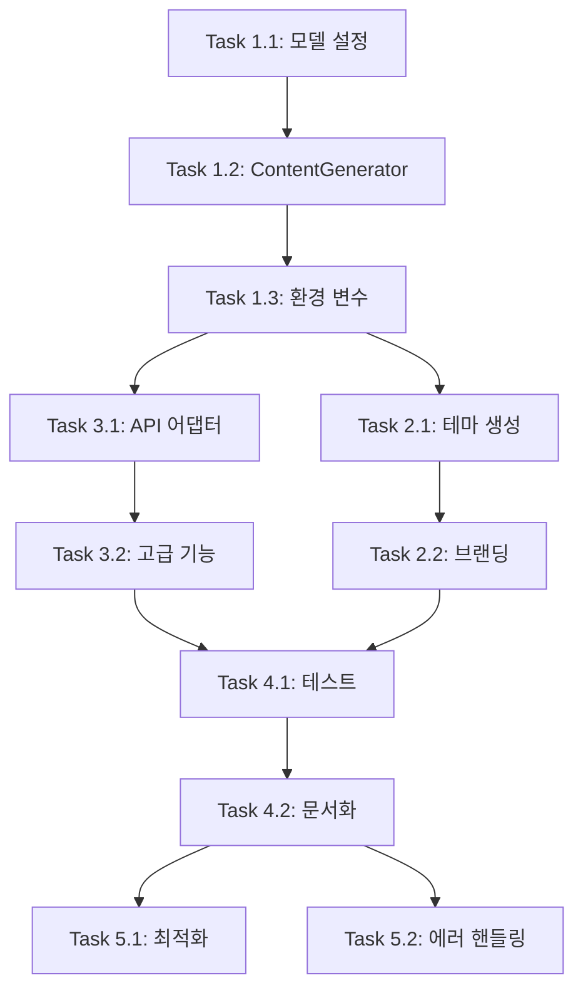

# Solar Code Development Tasks

Solar Code 프로젝트 개발을 위한 상세 태스크 문서입니다. Gemini CLI를 기반으로 Upstage Solar Pro2 모델을 통합하는 작업을 단계별로 정리했습니다.

## 📋 태스크 의존성 매트릭스



---

## 🏗️ Phase 1: 기본 설정 및 모델 통합

### Task 1.1: 모델 설정 변경 (세분화)
**우선순위**: 🔴 높음 | **예상 시간**: 4시간 (증가) | **의존성**: None

#### 전제조건 (Prerequisites)
- [ ] 개발 환경 설정 완료 (`npm install`, `npm run build` 성공)
- [ ] 코드베이스 전체 이해 (`CLAUDE.md` 숙지)
- [ ] Git 브랜치 생성 (`feature/phase1-model-config`)

#### 세부 작업 (Subtasks)
1. **코드베이스 분석 (1시간)**
   - [ ] `grep -r "gemini" packages/` 실행하여 모든 참조 위치 파악
   - [ ] `find packages/ -name "*gemini*"` 파일명에 gemini 포함된 파일 확인
   - [ ] 모델 관련 타입 정의 위치 파악:
     - `packages/core/src/config/models.ts`
     - `packages/core/src/core/geminiChat.ts` 
     - `packages/core/src/core/contentGenerator.ts`

2. **핵심 설정 변경 (2시간)**
   - [ ] `packages/core/src/config/models.ts` 수정:
     ```typescript
     // 변경 전
     export const DEFAULT_GEMINI_MODEL = 'gemini-2.0-flash-exp';
     
     // 변경 후  
     export const DEFAULT_SOLAR_MODEL = 'solar-pro2';
     export const SOLAR_PRO2_MODEL = 'solar-pro2';
     export const SOLAR_API_VERSION = 'v1';
     export const SOLAR_MAX_TOKENS = 4096; // Solar Pro2 제한사항 반영
     ```
   
   - [ ] 모델 관련 타입 정의 업데이트:
     ```typescript
     export type SupportedModel = 'solar-pro2' | 'solar-mini' | 'solar-1-mini';
     ```

3. **파일명 변경 계획 (1시간)**
   - [ ] `packages/core/src/core/geminiChat.ts` → `solarChat.ts` 변경 계획 수립
   - [ ] 관련 import 문 일괄 변경 스크립트 작성
   - [ ] 점진적 마이그레이션 전략 수립 (breaking change 최소화)

#### 파일 변경 목록
```
packages/core/src/config/models.ts        - 핵심 모델 상수 변경
packages/core/src/core/geminiChat.ts      - 파일명 변경 예정
packages/core/src/core/contentGenerator.ts - 추상 인터페이스 업데이트  
packages/core/src/types/                  - 모델 관련 타입 정의
```

#### 검증 기준 (Acceptance Criteria)
- [ ] `npm run build` 성공 (TypeScript 컴파일 에러 0개)
- [ ] `npm run typecheck` 통과
- [ ] 기존 모델 관련 단위 테스트 통과
- [ ] 새로운 Solar 상수들이 정상적으로 export됨

#### 실패 시 롤백 계획
- Git stash 활용하여 변경사항 임시 저장
- 점진적 변경으로 컴파일 에러 최소화
- 타입 에러 발생 시 기존 타입과 병행 유지

---

### Task 1.2: Solar Pro2 ContentGenerator 구현
**우선순위**: 🔴 높음 | **예상 시간**: 12시간 (증가) | **의존성**: Task 1.1

#### 전제조건 (Prerequisites)  
- [ ] Task 1.1 완료 및 검증
- [ ] **Solar Pro2 API 스펙 조사 완료** (신규 추가)
- [ ] Upstage 콘솔 계정 생성 및 API 키 발급

#### Solar Pro2 API 조사 결과 (필수 선행작업)
```markdown
## Solar Pro2 API 분석 결과 (TODO: 실제 조사 필요)

### 1. API 엔드포인트
- Base URL: `https://api.upstage.ai/v1/chat/completions`
- 인증: `Authorization: Bearer ${SOLAR_API_KEY}`
- Content-Type: `application/json`

### 2. 요청 형식 (OpenAI 호환)
{
  "model": "solar-pro2",
  "messages": [...],
  "stream": true/false,
  "tools": [...],  // Function calling 지원 여부 확인 필요
  "temperature": 0.7,
  "max_tokens": 4096
}

### 3. 응답 형식 차이점
- OpenAI와의 차이점 분석 필요
- 에러 코드 매핑 테이블 작성 필요
- Function calling 응답 형식 확인 필요
```

#### 세부 작업 (Subtasks)
1. **API 스펙 검증 (3시간) - 신규 추가**
   - [ ] Solar Pro2 API 문서 정독
   - [ ] Postman/curl로 기본 API 호출 테스트
   - [ ] Function calling 지원 여부 확인
   - [ ] Rate limit 및 제한사항 파악
   - [ ] 에러 응답 형식 문서화

2. **OpenAI ContentGenerator 분석 (2시간)**
   - [ ] `packages/core/src/core/openaiContentGenerator.ts` 코드 분석
   - [ ] 인터페이스 및 메서드 시그니처 파악
   - [ ] 기존 에러 처리 로직 이해

3. **Solar ContentGenerator 구현 (5시간)**
   - [ ] `packages/core/src/core/solarContentGenerator.ts` 생성
   - [ ] OpenAI 호환 API 호출 로직 구현
   - [ ] 환경 변수 처리 (`SOLAR_API_KEY`, `SOLAR_BASE_URL`)
   - [ ] 타임아웃 및 재시도 로직 (120초, 3회)
   - [ ] Solar Pro2 전용 파라미터 지원

4. **에러 처리 및 변환 (2시간)**
   - [ ] Solar Pro2 에러 코드 → 기존 에러 형식 변환
   - [ ] Rate limit 에러 특별 처리
   - [ ] 네트워크 에러 처리 강화

#### 구현 예시 코드 스니펫
```typescript
// packages/core/src/core/solarContentGenerator.ts
export class SolarContentGenerator implements ContentGenerator {
  private apiKey: string;
  private baseUrl: string;
  
  constructor() {
    this.apiKey = process.env.SOLAR_API_KEY || '';
    this.baseUrl = process.env.SOLAR_BASE_URL || 'https://api.upstage.ai/v1';
    
    if (!this.apiKey) {
      throw new Error('SOLAR_API_KEY environment variable is required');
    }
  }
  
  async generateContent(request: GenerateContentRequest): Promise<GenerateContentResponse> {
    // Solar Pro2 API 호출 구현
    const solarRequest = this.convertToSolarFormat(request);
    const response = await this.callSolarApi(solarRequest);
    return this.convertFromSolarFormat(response);
  }
  
  private async callSolarApi(request: SolarRequest): Promise<SolarResponse> {
    // 실제 API 호출 로직
    // 재시도, 타임아웃, 에러 처리 포함
  }
}
```

#### 파일 변경 목록
```
packages/core/src/core/solarContentGenerator.ts  - 신규 생성
packages/core/src/core/contentGenerator.ts       - 인터페이스 확장
packages/core/src/core/client.ts                - ContentGenerator 교체
packages/core/src/utils/errors.ts               - Solar 에러 타입 추가
```

#### 검증 기준 (Acceptance Criteria)
- [ ] Solar Pro2 API 기본 호출 성공 (단순 텍스트 질의응답)
- [ ] 환경 변수 누락 시 명확한 에러 메시지
- [ ] 기존 ContentGenerator 인터페이스 100% 호환
- [ ] API 에러 시 적절한 에러 변환 및 전파
- [ ] 타임아웃 및 재시도 로직 정상 동작

#### 위험 요소 및 대응책
- **위험**: Solar Pro2 API가 OpenAI와 호환되지 않을 수 있음
  **대응**: API 스펙 사전 조사 및 어댑터 패턴 적용
- **위험**: Function calling 미지원 가능성
  **대응**: 기본 구현 먼저 완성 후 점진적 기능 추가

---

### Task 1.3: 환경 변수 시스템 구축
**우선순위**: 🔴 높음 | **예상 시간**: 6시간 (증가) | **의존성**: Task 1.2

#### 전제조건 (Prerequisites)
- [ ] Task 1.2 완료 및 기본 API 호출 검증
- [ ] `.env` 파일 구조 이해
- [ ] 환경 변수 우선순위 정책 결정

#### 세부 작업 (Subtasks)
1. **환경 변수 정의 및 검증 (2시간)**
   ```bash
   # 필수 환경 변수
   UPSTAGE_API_KEY=your_api_key_here
   
   # 선택적 환경 변수  
   UPSTAGE_MODEL=solar-pro2              # 기본값: solar-pro2
   UPSTAGE_BASE_URL=https://api.upstage.ai/v1/solar  # 기본값 제공
   UPSTAGE_MAX_TOKENS=4096               # 기본값: 4096
   UPSTAGE_TIMEOUT=120000                # 기본값: 120초
   UPSTAGE_RETRY_COUNT=3                 # 기본값: 3회
   ```

2. **설정 시스템 통합 (3시간)**
   - [ ] `packages/cli/src/config/config.ts`에 Upstage 설정 추가
   - [ ] `packages/core/src/config/config.ts` Upstage 설정 병합
   - [ ] 환경 변수 검증 로직 구현
   - [ ] 우선순위: 환경변수 > CLI 인자 > 설정파일 > 기본값

3. **사용자 친화적 에러 처리 (1시간)**
   - [ ] API 키 누락 시 설정 가이드 표시
   - [ ] 잘못된 API 키 시 확인 방법 안내
   - [ ] 환경 변수 형식 오류 시 예시 제공

#### 구현 세부사항
```typescript
// packages/core/src/config/upstageConfig.ts
export interface UpstageConfig {
  apiKey: string;
  model: string;
  baseUrl: string;
  maxTokens: number;
  timeout: number;
  retryCount: number;
}

export function validateUpstageConfig(): UpstageConfig {
  const apiKey = process.env.UPSTAGE_API_KEY;
  
  if (!apiKey) {
    throw new ConfigError(
      'UPSTAGE_API_KEY is required. ' +
      'Get your API key from https://console.upstage.ai/ ' +
      'and set it with: export UPSTAGE_API_KEY="your_key_here"'
    );
  }
  
  return {
    apiKey,
    model: process.env.UPSTAGE_MODEL || 'solar-pro2',
    baseUrl: process.env.UPSTAGE_BASE_URL || 'https://api.upstage.ai/v1/solar',
    maxTokens: parseInt(process.env.UPSTAGE_MAX_TOKENS || '4096'),
    timeout: parseInt(process.env.UPSTAGE_TIMEOUT || '120000'),
    retryCount: parseInt(process.env.UPSTAGE_RETRY_COUNT || '3'),
  };
}
```

#### 파일 변경 목록
```
packages/core/src/config/upstageConfig.ts        - 신규 생성
packages/cli/src/config/config.ts               - Upstage 설정 통합
packages/core/src/utils/configErrors.ts         - 에러 타입 정의
.env.example                                     - 환경 변수 예시
docs/configuration.md                            - 설정 가이드 (신규)
```

#### 검증 기준 (Acceptance Criteria)
- [ ] `UPSTAGE_API_KEY` 설정 시 정상 동작
- [ ] 환경 변수 누락 시 명확한 가이드 메시지
- [ ] 잘못된 형식의 환경 변수 검증 및 에러 처리
- [ ] CLI에서 `solar --help`로 환경 변수 설정 방법 확인 가능
- [ ] 기본값 fallback 동작 확인

---

## 🎨 Phase 2: 브랜딩 및 UI (기존 유지)

### Task 2.1 & 2.2는 현재 수준으로 적절함

---

## 🔌 Phase 3: API 호환성 구현 (대폭 개선 필요)

### Task 3.1: API 어댑터 구현 (재구성)
**우선순위**: 🔴 높음 | **예상 시간**: 16시간 (증가) | **의존성**: Task 1.3, Solar Pro2 API 스펙 확정

#### 전제조건 (Prerequisites)
- [ ] Phase 1 완전 완료 및 검증
- [ ] **Solar Pro2 vs OpenAI/Gemini API 호환성 분석 완료**
- [ ] Function calling 지원 여부 최종 확인

#### 세부 작업 (Subtasks)
1. **호환성 분석 (4시간) - 필수 선행**
   - [ ] Solar Pro2 API 응답 구조 vs Gemini API 구조 비교
   - [ ] 메타데이터 필드 차이점 매핑 테이블 작성
   - [ ] Function calling 형식 차이점 분석
   - [ ] 스트리밍 응답 형식 비교
   - [ ] 토큰 사용량 계산 방식 차이점

2. **어댑터 패턴 설계 (3시간)**
   - [ ] `SolarApiAdapter` 클래스 설계
   - [ ] 요청 변환: Gemini format → Solar format
   - [ ] 응답 변환: Solar format → Gemini format  
   - [ ] 에러 코드 매핑 로직

3. **핵심 기능 구현 (6시간)**
   - [ ] 기본 텍스트 생성 어댑터
   - [ ] 스트리밍 응답 어댑터
   - [ ] 토큰 계산 어댑터
   - [ ] 에러 응답 변환기

4. **Function Calling 어댑터 (3시간)**
   - [ ] Solar Pro2 도구 호출 형식 확인
   - [ ] Gemini tools 형식 → Solar tools 형식 변환
   - [ ] 도구 실행 결과 응답 변환
   - [ ] 에러 케이스 처리

#### 검증 기준 (Acceptance Criteria)  
- [ ] 기존 Gemini CLI 모든 기본 명령어 동작 (예: 파일 읽기, 검색, 편집)
- [ ] Function calling 완벽 지원 (예: `/read`, `/write`, `/shell` 도구들)
- [ ] 스트리밍 응답 실시간 표시
- [ ] 에러 발생 시 의미있는 메시지 표시
- [ ] 토큰 사용량 정확한 계산 및 표시

---

## 📊 개선된 성공 지표

### 기술적 성공 지표
- [ ] **API 호환성**: Gemini CLI 기존 기능 100% 동작
- [ ] **성능**: 평균 응답 시간 < 5초 (Solar Pro2 특성 반영)
- [ ] **안정성**: API 에러율 < 1%, 복구 성공률 > 95%
- [ ] **품질**: TypeScript 컴파일 에러 0개, 테스트 통과율 > 95%

### 사용자 경험 지표  
- [ ] **설치**: 문서를 따라 5분 내 설치 및 실행 가능
- [ ] **사용성**: 한국어 질의 정확한 이해 및 응답
- [ ] **에러 처리**: 모든 에러에 해결 방법 포함한 메시지
- [ ] **문서화**: 신규 사용자 독립적 사용 가능한 수준

---

## 🚨 위험 요소 및 대응 계획

### 높은 위험도
1. **Solar Pro2 API 호환성 불확실**
   - **대응**: Phase 1에서 API 스펙 완전 분석 후 진행
   - **Plan B**: OpenAI 호환 모드 또는 자체 어댑터 개발

2. **Function Calling 미지원**  
   - **대응**: 기본 텍스트 생성 먼저 완성
   - **Plan B**: 제한된 기능으로라도 MVP 출시

### 중간 위험도
3. **성능 이슈 (Rate Limit)**
   - **대응**: Phase 5에서 큐잉 시스템 구현
   - **완화**: 사용자에게 제한사항 명확히 안내

4. **기존 테스트 실패**
   - **대응**: 점진적 마이그레이션, 병행 운영 기간 설정
   - **완화**: Phase 4에서 테스트 커버리지 확대
