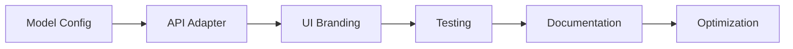

# Solar Code Development Resources

This directory contains Solar-specific development resources, documentation, and assets for the Solar Code project. These materials support the development, configuration, and deployment of Solar Code as an AI-powered command-line tool using Upstage Solar Pro2.

## Overview

Solar Code is built on the foundation of the Gemini CLI architecture but enhanced specifically for Upstage Solar Pro2 integration. This directory provides comprehensive resources for developers working on Solar Code, including project requirements, API setup guides, development tasks, and reference materials.

## 📁 Directory Contents

### Core Documentation

#### `PRD.md` - Project Requirements Document

Comprehensive project requirements document written in Korean that outlines:

- **Project Overview**: Solar Code as a code assistant tool
- **Development Phases**: Structured development approach from basic setup to advanced features
- **Technical Specifications**: Detailed technical requirements and implementation guidelines
- **Milestone Planning**: Phase-based development roadmap with clear deliverables

**Key Features Covered**:

- Model integration (Gemini → Solar Pro2)
- Branding and UI customization
- API adapter implementation
- Testing and documentation strategies
- Performance optimization plans

#### `UPSTAGE_API_SETUP.md` - API Configuration Guide

Detailed setup guide in Korean for configuring Upstage Solar Pro2 API:

- **Environment Variables**: Complete list of required and optional configuration
- **API Key Management**: Step-by-step API key generation and security best practices
- **Authentication Setup**: Multiple authentication methods and troubleshooting
- **Cross-Platform Configuration**: Windows, macOS, and Linux setup instructions

**Configuration Coverage**:

- Environment variable setup (`UPSTAGE_API_KEY`, `UPSTAGE_MODEL`, etc.)
- .env file configuration and search hierarchy
- API endpoint configuration and validation
- Security best practices and troubleshooting

#### `DEVELOPMENT_TASKS.md` - Development Task Breakdown

Comprehensive task breakdown document that provides:

- **Task Dependencies**: Visual dependency matrix with Mermaid diagrams
- **Phase Organization**: Structured development phases with clear prerequisites
- **Time Estimates**: Realistic time estimates for each development task
- **Priority Classification**: Task prioritization with color-coded urgency levels

**Development Phases**:

1. **Phase 1**: Basic setup and model integration
2. **Phase 2**: Branding and UI customization
3. **Phase 3**: API adapter and advanced features
4. **Phase 4**: Testing and documentation
5. **Phase 5**: Optimization and error handling

#### `pre-PRD.md` - Pre-Project Requirements

Initial project analysis and requirements gathering document that includes:

- **Market Analysis**: Comparison with similar tools and opportunities
- **Technical Feasibility**: Assessment of Gemini CLI adaptation approach
- **Resource Requirements**: Development resources and timeline estimation
- **Risk Assessment**: Potential challenges and mitigation strategies

### Assets

#### `assets/soalr-code-screenshot.png`

Visual documentation and branding assets:

- **Screenshot Documentation**: Visual representation of Solar Code in action
- **UI Reference**: User interface examples and design patterns
- **Branding Assets**: Solar Code visual identity and styling

### Reference Materials

#### `gemini-cli-reference/` - Original Gemini CLI Reference

Complete reference copy of the original Gemini CLI project:

- **Architecture Reference**: Understanding the base architecture and patterns
- **Implementation Examples**: Code examples and implementation patterns
- **Migration Guidance**: Comparison points for Solar Code adaptation
- **Feature Parity**: Ensuring all Gemini CLI features are maintained

#### `qwen-code-reference/` - QwenLM Code Reference

Reference implementation from QwenLM's qwen-code project:

- **Model Integration Patterns**: How other projects integrate alternative models
- **API Adaptation Examples**: Real-world examples of model API switching
- **Best Practices**: Proven approaches for CLI model integration
- **Architecture Insights**: Alternative architectural approaches and solutions

### Utilities

#### `solar-retro.js` - Development Utility

Development utility script for project retrospection and analysis:

- **Code Analysis**: Automated analysis of codebase changes and progress
- **Migration Tracking**: Progress tracking for Gemini → Solar migration
- **Performance Metrics**: Development velocity and quality metrics
- **Retrospective Data**: Historical development data and insights

## 🚀 Getting Started

### For New Developers

1. **Read Project Overview**:

   ```bash
   # Start with the project requirements
   cat solar-code/PRD.md
   ```

2. **Set Up Development Environment**:

   ```bash
   # Follow the API setup guide
   cat solar-code/UPSTAGE_API_SETUP.md
   ```

3. **Understand Development Tasks**:

   ```bash
   # Review development task breakdown
   cat solar-code/DEVELOPMENT_TASKS.md
   ```

4. **Study Reference Implementations**:
   ```bash
   # Examine reference projects
   ls solar-code/gemini-cli-reference/
   ls solar-code/qwen-code-reference/
   ```

### For Project Managers

1. **Project Planning**:
   - Review `PRD.md` for comprehensive project scope
   - Use `DEVELOPMENT_TASKS.md` for sprint planning and task assignment
   - Reference dependency matrix for task sequencing

2. **Resource Allocation**:
   - Time estimates provided in task breakdown
   - Priority classifications for resource allocation
   - Phase-based milestone planning

3. **Progress Tracking**:
   - Use task completion checklists in development documents
   - Monitor progress against phase deliverables
   - Track API integration milestones

### For QA and Testing

1. **Test Planning**:
   - API integration test scenarios in setup guide
   - Configuration validation procedures
   - Cross-platform testing requirements

2. **Documentation Testing**:
   - Validate setup instructions across platforms
   - Test API configuration scenarios
   - Verify troubleshooting procedures

## 🔧 Development Workflow

### Phase-Based Development

#### Phase 1: Foundation (Weeks 1-2)

- **Model Integration**: Switch from Gemini to Solar Pro2
- **Basic Configuration**: Environment variable setup
- **Core API Adapter**: Basic API communication

#### Phase 2: Customization (Weeks 3-4)

- **UI Branding**: Solar Code visual identity
- **Theme Development**: Custom color schemes and styling
- **User Experience**: Improved UX for Solar Pro2 features

#### Phase 3: Enhancement (Weeks 5-6)

- **Advanced Features**: Solar Pro2-specific capabilities
- **Performance Optimization**: Token usage and response optimization
- **Error Handling**: Robust error handling and recovery

#### Phase 4: Validation (Weeks 7-8)

- **Comprehensive Testing**: Unit, integration, and E2E tests
- **Documentation**: User guides and API documentation
- **Quality Assurance**: Performance and reliability validation

#### Phase 5: Polish (Weeks 9-10)

- **Performance Tuning**: Final optimizations
- **User Feedback Integration**: Community feedback incorporation
- **Release Preparation**: Distribution and deployment readiness

### Task Dependencies

Understanding task dependencies is crucial for efficient development:



## 🌐 Internationalization

### Korean Development Focus

- **Documentation**: Comprehensive Korean documentation for local developers
- **Error Messages**: Korean error messages and help text
- **Cultural Adaptation**: UI and UX adapted for Korean development practices
- **Community Support**: Korean developer community engagement

### Localization Resources

- **Setup Guides**: Korean API setup and configuration guides
- **Troubleshooting**: Korean troubleshooting and support documentation
- **Examples**: Korean code examples and usage patterns
- **Community**: Korean developer community resources and support

## 🔗 Integration Points

### Upstage Ecosystem Integration

- **Solar Pro2 API**: Direct integration with Upstage Solar Pro2
- **Authentication**: Upstage API key management and security
- **Documentation**: Links to official Upstage documentation
- **Support**: Integration with Upstage support channels

### Development Tool Integration

- **VS Code**: Enhanced VS Code integration for Korean developers
- **Git Workflow**: Optimized Git workflow for Solar Code development
- **CI/CD**: Continuous integration adapted for Solar Pro2 testing
- **Deployment**: Streamlined deployment for Korean cloud platforms

## 📚 Additional Resources

### External Documentation

- **[Upstage Official Documentation](https://console.upstage.ai/docs/getting-started)**
- **[Solar Pro2 API Reference](https://console.upstage.ai/docs/)**
- **[Upstage Cookbook](https://github.com/UpstageAI/cookbook)**
- **[Solar Prompt Handbook](https://console.upstage.ai/docs/solar-pro2-handbook)**

### Community Resources

- **GitHub Issues**: [Solar Code Issues](https://github.com/solar-code/solar-code/issues)
- **Discussions**: Community discussions and feature requests
- **Contributions**: Community contribution guidelines and processes
- **Support**: Community support and troubleshooting resources

### Development References

- **Gemini CLI**: Original architecture and implementation patterns
- **QwenLM Code**: Alternative model integration approaches
- **Best Practices**: Industry best practices for CLI AI tool development
- **Performance**: Optimization techniques for AI CLI applications

## 🤝 Contributing

### Documentation Contributions

1. **Korean Documentation**: Enhance Korean documentation and guides
2. **API Examples**: Add comprehensive API usage examples
3. **Troubleshooting**: Expand troubleshooting guides and solutions
4. **Best Practices**: Document development best practices and patterns

### Code Contributions

1. **Model Integration**: Improve Solar Pro2 integration and features
2. **Performance**: Optimize performance and resource usage
3. **Error Handling**: Enhance error handling and recovery
4. **Testing**: Expand test coverage and validation

### Community Building

1. **Korean Community**: Build and support Korean developer community
2. **Documentation Translation**: Support multilingual documentation
3. **Examples and Tutorials**: Create comprehensive learning resources
4. **Support**: Provide community support and guidance

## Related Documentation

- [Core Package Documentation](../packages/core/README.md)
- [CLI Package Documentation](../packages/cli/README.md)
- [Architecture Overview](../docs/architecture.md)
- [Main Project README](../README.md)
